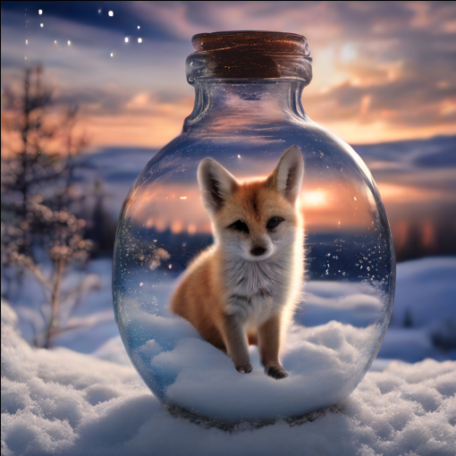
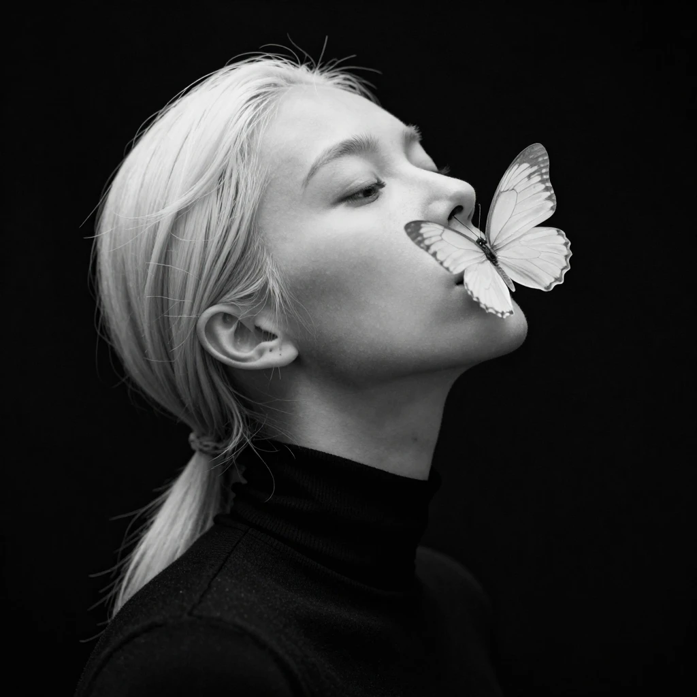
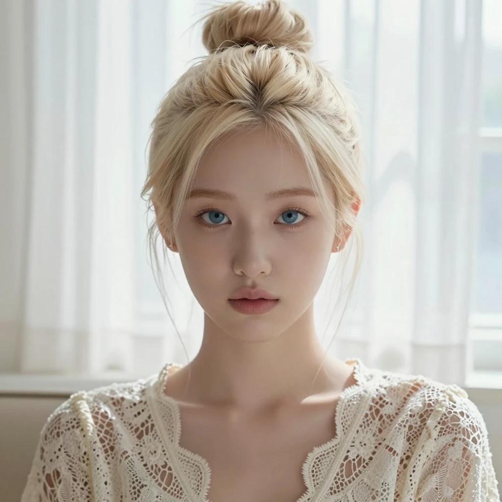
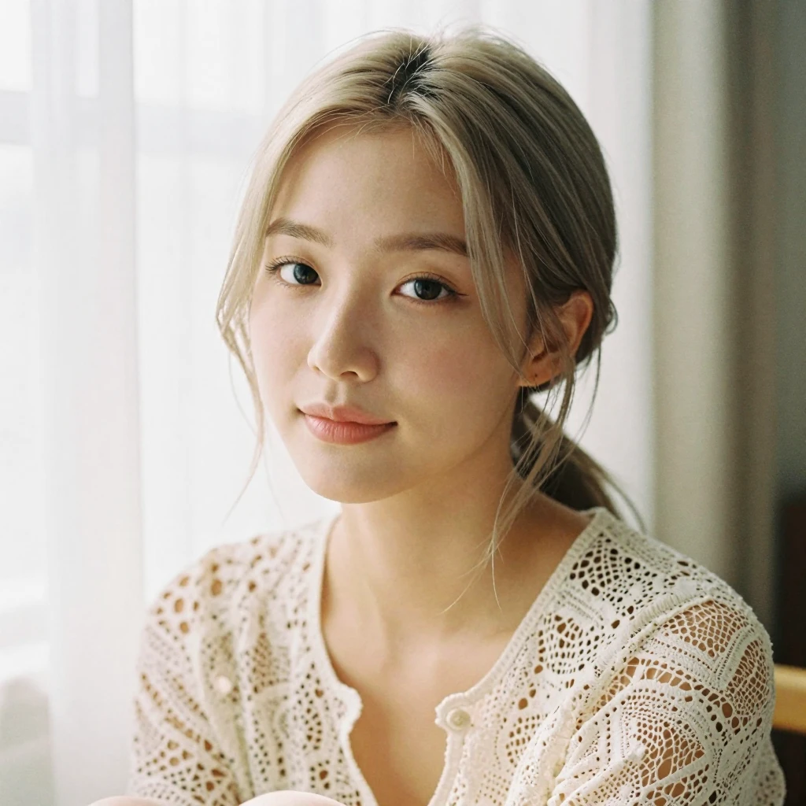
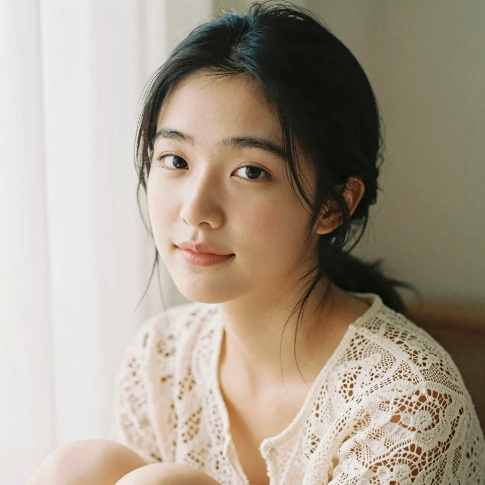
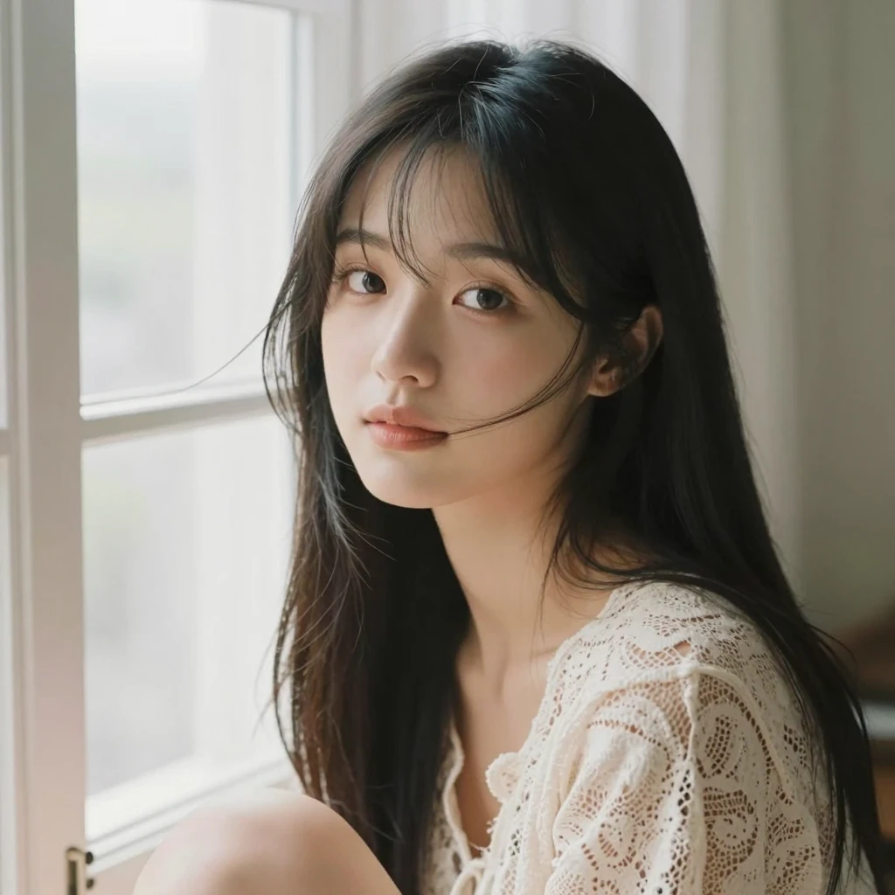

# 프롬프트 개선 사례: 원하는 사진에 다가가는 법

> 정리일: 2026-09-26
> 모델: Z-Image-Turbo Int8 (`z_image_turbo_int8_convrot` + `qwen_3_4b_fp8_mixed` + `ae`), steps 8
> GPU: RX 9070 XT, 1장에 약 20초 이내

## 핵심 교훈 먼저

1. **한 번에 한 가지만 바꾼다.** 그래야 무엇이 결과를 바꿨는지 알 수 있다.
2. **완벽하게 만들수록 가짜 같아진다.** 적당한 피부결, 옅은 표정, 필름 느낌이 "진짜 사람"을 만든다.
3. **"하지 마"보다 "이렇게 해"로 쓴다.** `no freckles`라고 쓰면 오히려 주근깨가 생길 수 있다. → `even-toned skin`
4. **국적보다 외모를 묘사한다.** AI는 국적 단어를 고정관념대로 그리기 쉽다.
5. **AI는 도메인 지식이 없다.** 틀린 부분을 알아보고 구체적으로 알려주는 게 사람의 역할이다.
6. **마음에 드는 결과는 seed와 프롬프트를 함께 저장한다.**

---

## 0단계: 워밍업 실험들

### seed 고정 + 단어 하나만 바꾸기 (SDXL Turbo)

| 여우 | 고양이 |
|---|---|
|  |  |
| `... cute fennec fox snow HDR sunset` | `... cute kitten snow HDR sunset` |

- seed를 `fixed`로 두고 `fennec fox` → `kitten`만 바꿨다.
- 병, 노을, 배경 구도가 **거의 그대로** 유지되고 동물만 바뀌었다.
- 반면 `with a galaxy inside`(병 안의 은하)는 거의 빠졌다. SDXL은 키워드가 많으면 일부를 무시한다. → `(galaxy inside:1.4)`처럼 강조할 수 있다.

### AI는 도메인 지식이 없다


- 프롬프트: 정비사가 진단기를 **OBD 포트**에 연결하는 장면
- 결과: 사진 품질은 좋지만 케이블이 **앞바퀴 위 펜더**에 꽂혀 있다. 실제 OBD 포트는 **운전석 대시보드 아래**에 있다.
- 해결: 위치를 구체적으로 쓴다. `the OBD-II port located under the steering wheel near the driver's knee`
- 교훈: 이런 실수를 알아보는 게 **도메인 전문가(나)의 역할**이다.

---

## 1단계: 흑백 나비 화보 (출발점)



```
Dramatic black and white high fashion studio portrait, close-up bust shot, pale platinum blonde woman with sleek low ponytail, head tilted upward, eyes softly closed, wearing a fitted black turtleneck top. A large translucent pale white butterfly hovers gently right at her lips, delicate detailed wing veins visible. Hard rim light creates glowing bright white halo around her hair and face, deep inky pure black minimalist background, stark high contrast chiaroscuro lighting, film grain texture, moody ethereal atmosphere, monochrome, editorial fashion photography, shot on 35mm film, soft subtle skin texture, sharp focus on butterfly and facial profile, vertical composition, minimalist dark aesthetic, artistic surreal fashion
```

- 거의 모든 요소가 빠짐없이 들어갔다. Z-Image는 **언어 모델(Qwen3)** 이 긴 문장을 읽어서 요소를 잘 안 빠뜨린다.
- 아쉬운 점: `vertical composition`을 썼는데 크기가 1024×1024라 정사각형으로 나왔다. → **프롬프트와 크기를 맞춰야 한다** (세로면 832×1216).

---

## 2단계: 한국인으로 바꿨더니 인형 같아짐 😅



**핵심 표현:** `beautiful young Korean woman with K-pop idol visuals`, `pale platinum-blonde hair`, `flawless clear glass skin`, `striking bright blue eyes`, `symmetrical composition`

### 왜 부자연스러웠나
| 원인 | 결과 |
|---|---|
| 백금발 + 파란 눈 + 한국인 얼굴 | 가발과 컬러렌즈를 한 **인형** 같음 |
| `flawless glass skin` | 피부결이 없어서 **플라스틱/CG** 같음 |
| 정면 + 대칭 + 무표정 | **마네킹, 증명사진** 느낌 |
| `K-pop idol visuals` | **과하게 보정된 얼굴**을 부름 |

- 요청한 "귀걸이 없음", "뿌리까지 금발"도 완벽하게 반영되지 않았다.

---

## 3단계: 자연스러움을 더했더니 진짜 사진이 됨



```
Soft intimate fine art portrait of a beautiful young Korean woman, facing the camera, looking into the lens with a gentle calm expression and the faintest hint of a smile. Soft ash-blonde hair of one even color, loosely tied back with a few wispy strands falling naturally around her face. Clear healthy skin with a natural soft glow and subtle realistic texture, gentle natural makeup, deep dark brown eyes with a soft catchlight. Bare ears. She wears a delicate cream lace blouse, sitting by a window with sheer white curtains. Gentle diffused morning light, soft warm neutral tones, shallow depth of field, shot on 35mm film, candid and natural fine art photography.
```

| 이전 | 변경 | 효과 |
|---|---|---|
| `platinum-blonde` | `soft ash-blonde` | 한국에서 실제로 많이 하는 탈색 컬러 |
| `bright blue eyes` | `deep dark brown eyes with a soft catchlight` | 눈 속 반사광이 **생기**를 줌 |
| `flawless glass skin` | `natural soft glow and subtle realistic texture` | 진짜 피부처럼 보임 |
| 무표정 | `faintest hint of a smile` | 사람다운 표정 |
| `symmetrical composition` | 삭제 | 완벽한 대칭은 인공적 |
| `K-pop idol visuals` | 삭제 | 과한 보정 방지 |
| 추가 | `shot on 35mm film, candid and natural` | 화보가 아닌 **실제 사진** 느낌 |

- 남은 문제: 가르마 뿌리가 살짝 어두움. → `fully and evenly colored from the scalp to the ends, no visible roots`

---

## 4단계: 흑발로 변경



| 이전 | 변경 |
|---|---|
| `Soft ash-blonde hair of one even color` | `Natural glossy black hair` |

- 더 자연스러워졌다.
- 새 문제: 볼에 **작은 점**이 생겼다. `subtle realistic texture`가 피부를 진짜처럼 만들면서 점까지 생긴 것. → `even-toned skin`으로 바꿔서 해결

---

## 5단계: 긴 생머리 + 시스루 앞머리 + 바람 🎯 (최종)



```
Soft intimate fine art portrait of a beautiful young Korean woman, facing the camera, looking into the lens with a gentle calm expression and the faintest hint of a smile. Long straight natural black hair worn down, gently lifted and flowing in a soft breeze from the open window, a few loose strands drifting across her cheek, with soft wispy see-through bangs lightly moving over her forehead, one side tucked behind her bare ear. Clear healthy even-toned skin with a natural soft glow, gentle natural makeup, deep dark brown eyes with a soft catchlight. She wears a delicate cream lace blouse, sitting by an open window, sheer white curtains billowing softly behind her. Gentle diffused morning light, soft warm neutral tones, shallow depth of field, shot on 35mm film, candid and natural fine art photography.
```

이 단계는 한 번에 하나씩 세 번 바꿨다.

| 순서 | 추가한 표현 | 뜻 |
|---|---|---|
| ① 긴 생머리 | `Long straight natural black hair worn down, flowing smoothly past her shoulders` | 풀어 내린 긴 생머리 |
| | `one side tucked behind her bare ear` | 머리를 풀면 귀가 가려지니 **한쪽만 넘겨서** 깨끗한 귀를 보여줌 |
| ② 시스루 앞머리 | `soft wispy see-through bangs lightly covering her forehead` | 이마가 살짝 비치는 가벼운 앞머리 |
| ③ 바람 | `gently lifted and flowing in a soft breeze from the open window` | 창문 바람에 머리가 살짝 흩날림 |
| | `a few loose strands drifting across her cheek` | 볼을 스치는 머리카락 몇 가닥 (**가장 큰 포인트**) |
| | `sitting by an open window, sheer white curtains billowing softly` | 커튼도 함께 날려서 바람이 **자연스럽게** 보임 |

---

## 다시 쓸 수 있는 도구 상자

### 자연스러운 인물 사진 공식
> **인물 설명 + 표정 + 머리 + 피부 + 눈 + 옷 + 장소 + 빛 + 색감 + 촬영 스타일**

### 자연스럽게 만드는 표현
| 목적 | 표현 |
|---|---|
| 진짜 사진 느낌 | `shot on 35mm film`, `candid and natural` |
| 사람다운 표정 | `gentle calm expression`, `the faintest hint of a smile` |
| 살아 있는 눈 | `soft catchlight` |
| 깨끗하지만 진짜 같은 피부 | `clear healthy even-toned skin with a natural soft glow` |
| 부드러운 빛 | `gentle diffused morning light`, `window light` |

### 피하는 게 좋은 표현
| 표현 | 이유 |
|---|---|
| `flawless`, `glass skin` 과다 | 플라스틱 피부 |
| `symmetrical composition` | 인공적인 대칭 |
| `K-pop idol visuals` 같은 스타일 단어 | 과한 보정 |
| `no freckles`, `no earrings` 같은 부정 표현 | 오히려 그 요소를 부를 수 있음 (cfg 1이라 부정 프롬프트도 꺼져 있음) |
| 실제 연예인 이름 | 초상권 문제 |

### 머리 스타일 표현
| 스타일 | 표현 |
|---|---|
| 흑발 | `natural glossy black hair` / `jet black hair` |
| 탈색 금발 | `soft ash-blonde hair` / `natural light blonde` |
| 올림머리 | `loosely tied back`, `loose messy bun` |
| 긴 생머리 | `long straight hair worn down, flowing past her shoulders` |
| 시스루 앞머리 | `soft wispy see-through bangs` |
| 바람 | `gently lifted and flowing in a soft breeze` |

### 결과가 기대와 다를 때
| 문제 | 해결 |
|---|---|
| 요소가 빠짐 | `(단어:1.3)`으로 강조 |
| 요소가 과함 | 그 단어를 빼거나 더 약한 표현으로 |
| 얼굴이 마음에 안 듦 | seed를 `randomize`로 여러 장 뽑기 |
| 마음에 드는 얼굴 유지 | seed를 `fixed`로 고정하고 한 가지씩 변경 |

## 결과 저장 팁
- ComfyUI가 만든 **원본 PNG**에는 워크플로우(프롬프트, seed, 설정)가 들어 있다. ComfyUI 화면에 **끌어다 놓으면** 그대로 다시 열린다.
- webp, jpg로 변환하거나 메신저로 보낸 파일은 이 정보가 사라진다. 원본 PNG는 `output` 폴더에 따로 보관한다.
